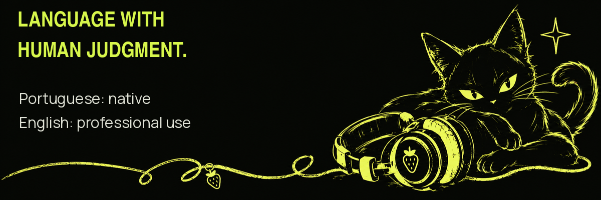
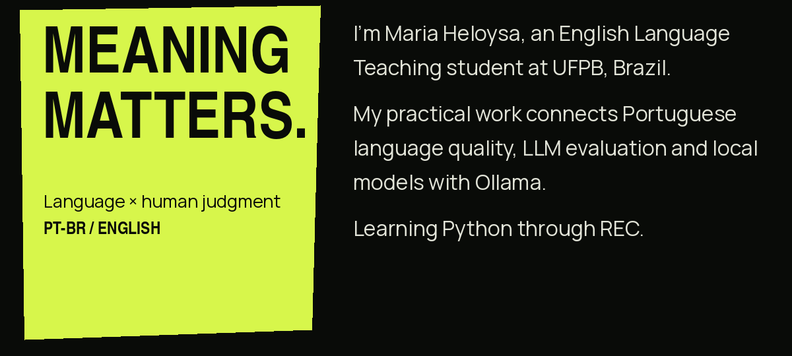
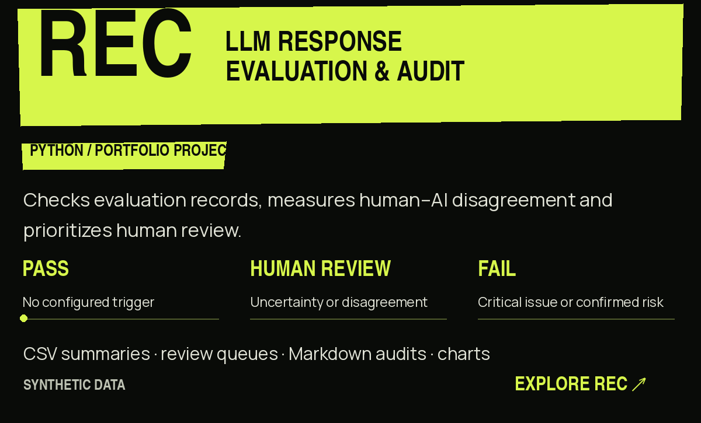
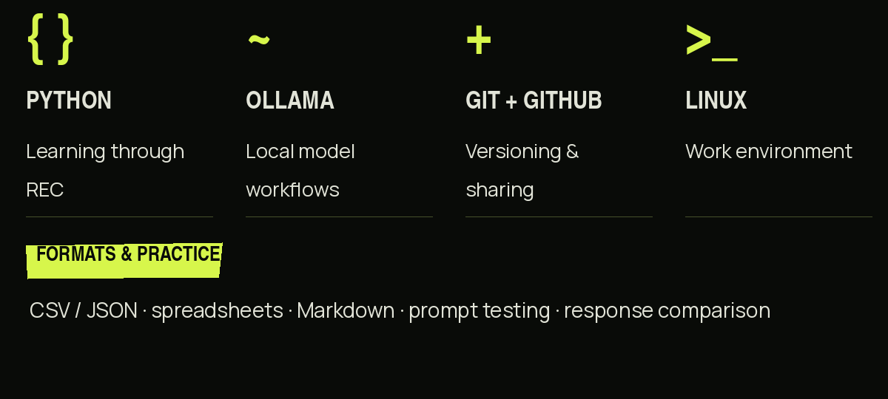
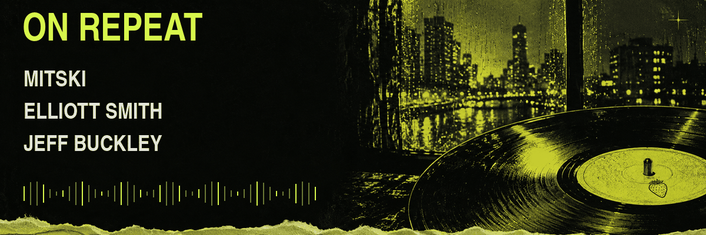

[Explore REC ↗](https://github.com/lainbacground/rec)

 

Project notes & text version

Maria Heloysa — LLM Evaluation · Data Annotation · Portuguese Language.
English Language Teaching student at UFPB, Brazil. Hands-on work with Portuguese language quality, LLM response evaluation and local models with Ollama. Developing Python skills through REC.

REC uses synthetic illustrative data. It validates fields, types, ranges, IDs and duplicates; measures exact agreement, agreement within one point, signed bias and mean absolute score difference; applies FAIL > HUMAN_REVIEW > PASS precedence while preserving trigger reasons; and exports evaluated responses, a deterministic review queue, CSV summaries, Markdown audits and charts.

Python · Ollama · Git · GitHub · Linux · CSV · JSON · Markdown · spreadsheets.

Music: Mitski, Elliott Smith, Jeff Buckley. NANA, Wong Kar-wai and Fallen Angels.

[REC](https://github.com/lainbacground/rec) · [LinkedIn](https://www.linkedin.com/in/mariaheloysa-ai/) · [Email](mailto:mariaheloysa888@gmail.com)

